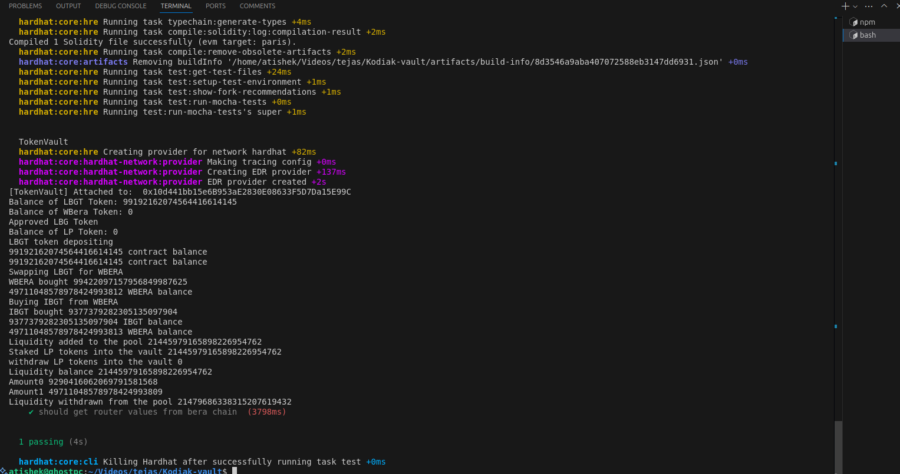

# Sample Hardhat Project

This project demonstrates a basic Hardhat use case. It comes with a sample contract, a test for that contract, and a script that deploys that contract.

Try running some of the following tasks:

```shell
npx hardhat help
npx hardhat test
REPORT_GAS=true npx hardhat test
npx hardhat node
npx hardhat run scripts/deploy.js
```


Flow:

Deposit:


 User calls depositLBGT function which takes LBGT and then sells it on burbear for WBERA,

 then uses part of the WBERA to buy IBGT. Then add WBERA and IBGT to the WBERA-IBGT LP vault using Kodiak Router  to get LP tokens. *done* 


Based on the amount of LP tokens received, the user gets vault shares(VCANA). 

Which means the asset of the vault is LP tokens and not LBGT. 

These LP tokens are then staked into the Infrared IBGT-WBERA Vault.
*done*


Withdraw: 


User calls withdrawLBGT functions, their shares(VCANA) are burnt, 

the corresponding amount of LP tokens are unstaked from the 

Infrared IBGT-WBERA Vault and then these LP tokens are again used to remove liquidity from the Kodiak Router to get WBERA and IBGT.

### done 

Both of them are sold to get LBGT and returned to the user.

Reinvest: The contract should claim rewards from the Infrared vault. Sell the rewards for WBERA. Use part of the WBERA to get IBGT, add these to the WBERA-IBGT LP vault using Kodiak Router  to get LP tokens, and then stake these LP tokens back into the Infrared Vault.

Swapping guide:

LBGT to WBERA and vice versa: Burrbear
WBERA to IBGT and vice versa: Kodiak Swap


CA:

LBGT: 0x32Cf940DB5d7ea3e95e799A805B1471341241264
WBERA: 0x7507c1dc16935B82698e4C63f2746A2fCf994dF8
IBGT: 0x46eFC86F0D7455F135CC9df501673739d513E982
WBERA-IBGT v3pool address : 0x4d41822c1804ffF5c038E4905cfd1044121e0E85
WBERA-IBGT LP (KODIAK-10): 0x7fd165B73775884a38AA8f2B384A53A3Ca7400E6

KodiakSwapV3: 0x66E8F0Cf851cE9be42a2f133a8851Bc6b70B9EBd
Kodiak RouterV3: 0x4d41822c1804ffF5c038E4905cfd1044121e0E85


Burrbear Swap/Router: 0xFDb2925aE2d3E2eacFE927611305e5e56AA5f832
Infrared IBGT-WBERA Vault: 0x763F65E5F02371aD6C24bD60BCCB0b14E160d49b


https://infrared.finance/vaults/kodiak-ibgt-wbera?details=false

https://app.kodiak.finance/#/liquidity/pools/0x7fd165b73775884a38aa8f2b384a53a3ca7400e6?farm=0x6a283822F6F03dD886c2afABA0A731e35F129391&chain=berachain_bartio	


// ADDING LIQ in v3 pool WBERA-IBGT LP 
[text](https://bartio.beratrail.io/tx/0x9c0e45fb9cddb48fbd9c80ffc9a7e6f6a75ee7fc49a449904e9c2f00bac2121c)


## current progress 

